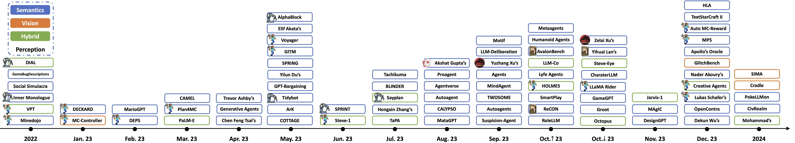

# A Survey on Game Playing Agents and Large Models: Methods, Applications, and Challenges
---
<div align="center">


[](https://awesome.re)
[](https://badges.pufler.dev/visits/BAAI-Agents/GPA-LM)


<a href='https://arxiv.org/pdf/2403.10249.pdf'></a>
</div>

🏃 **Coming soon**: Add one-sentence intro to each paper.

<div align=center></div>

<div align="center">

[[Arxiv]](https://arxiv.org/abs/2403.10249) ♦ [[PDF]](https://arxiv.org/pdf/2403.10249.pdf)
</div>

## 🌟 News
✨ [2024/02/06] Creation of this repository to maintain the list of papers on LLM-based agents for game playing. More papers are coming soon!

<div align=center></div>

## 2024/08
- [2024/08/07] Optimus-1: Hybrid Multimodal Memory Empowered Agents Excel in Long-Horizon Tasks. [[paper](https://arxiv.org/pdf/2408.03615.pdf)] [[code](https://cybertronagent.github.io/Optimus-1.github.io/)]

## 2024/07
- [2024/07/21] VideoGameBunny: Towards vision assistants for video games. [[paper](https://arxiv.org/pdf/2407.15295.pdf)] [[code](https://videogamebunny.github.io/)]
- [2024/07/05] Autoverse: An Evolvable Game Language for Learning Robust Embodied Agents. [[paper](https://arxiv.org/pdf/2407.04221.pdf)]
- [2024/07/02] Cradle: Empowering Foundation Agents Towards General Computer Control. [[paper](https://arxiv.org/pdf/2403.03186.pdf)] [[project](https://baai-agents.github.io/Cradle/)]

## 2024/06
- [2024/06/20] Two Giraffes in a Dirt Field: Using Game Play to Investigate Situation Modelling in Large Multimodal Models. [[paper](https://arxiv.org/pdf/2406.14035.pdf)]

## 2024/05
- [2024/05/23] Towards Efficient LLM Grounding for Embodied Multi-Agent Collaboration. [[paper](https://arxiv.org/pdf/2405.14314.pdf)] [[project](https://read-llm.github.io/#)]
- [2024/05/11] Prompt-Gaming: A Pilot Study on LLM-Evaluating Agent in a Meaningful Energy Game. [[paper](https://dl.acm.org/doi/pdf/10.1145/3613905.3650774)]

## 2024/04
- [2024/04/17] AgentKit: Flow Engineering with Graphs, not Coding. [[paper](https://arxiv.org/pdf/2404.11483.pdf)] [[code](https://github.com/holmeswww/AgentKit)]
- [2024/04/16] Self-playing Adversarial Language Game Enhances LLM Reasoning. [[paper](https://arxiv.org/pdf/2404.10642.pdf)] [[code](https://github.com/Linear95/SPAG)]

## 2024/03
- [2024/03/23] Evaluate LLMs in real time with Street Fighter III. [[code](https://github.com/OpenGenerativeAI/llm-colosseum)]
- [2024/03/19] Embodied LLM Agents Learn to Cooperate in Organized Teams. [[paper](https://arxiv.org/pdf/2403.12482.pdf)]
- [2024/03/18] Can LLM-Augmented Autonomous Agents Cooperate?, An Evaluation of Their Cooperative Capabilities through Melting Pot. [[paper](https://arxiv.org/pdf/2403.11381.pdf)]
- [2024/03/18] EnvGen: Generating and Adapting Environments via LLMs for Training Embodied Agents. [[paper](https://arxiv.org/pdf/2403.12014.pdf)]
- [2024/03/18] MineDreamer: Learning to Follow Instructions via Chain-of-Imagination for Simulated-World Control. [[paper](https://arxiv.org/pdf/2403.12037.pdf)] [[code](https://github.com/Zhoues/MineDreamer)]
- [2024/03/14] Scaling Instructable Agents Across Many Simulated Worlds. [[paper](https://storage.googleapis.com/deepmind-media/DeepMind.com/Blog/sima-generalist-ai-agent-for-3d-virtual-environments/Scaling%20Instructable%20Agents%20Across%20Many%20Simulated%20Worlds.pdf)]
- [2024/03/13] Hierarchical Auto-Organizing System for Open-Ended Multi-Agent Navigation. [[paper](https://arxiv.org/pdf/2403.08282.pdf)]
- [2024/03/13] SOTOPIA-$\pi$: Interactive Learning of Socially Intelligent Language Agents. [[paper](https://arxiv.org/pdf/2403.08715.pdf)] [[code](https://github.com/sotopia-lab/sotopia-pi)]
- [2024/03/08] Will GPT-4 Run DOOM? [[paper](https://arxiv.org/pdf/2403.05468.pdf)] [[code](https://github.com/adewynter/Doom)]
- [2024/03/05] Towards General Computer Control: A Multimodal Agent for Red Dead Redemption II as a Case Study. [[paper](https://tellarin.com/borje/papers/baaitr24gcc.pdf)] [[project](https://baai-agents.github.io/Cradle/)]
- [2024/03/01] Playing NetHack with LLMs: Potential & Limitations as Zero-Shot Agents. [[paper](https://arxiv.org/pdf/2403.00690.pdf)] [[code](https://arxiv.org/pdf/2403.00690.pdf)]

## 2024/02
- [2024/02/29] RL-GPT: Integrating Reinforcement Learning and Code-as-policy. [[paper](https://arxiv.org/pdf/2402.19299.pdf)]
- [2024/02/27] Agent-Pro: Learning to Evolve via Policy-Level Reflection and Optimization. [[paper](https://arxiv.org/pdf/2402.17574.pdf)] [[code](https://github.com/zwq2018/Agent-Pro)]
- [2024/02/21] PCA-Bench: Evaluating Multimodal Large Language Models in Perception-Cognition-Action Chain. [[paper](https://arxiv.org/pdf/2402.15527.pdf)] [[code](https://github.com/pkunlp-icler/PCA-EVAL)]
- [2024/02/20] What if LLMs Have Different World Views: Simulating Alien Civilizations with LLM-based Agents. [[paper](https://arxiv.org/pdf/2402.13184.pdf)] [[code](https://github.com/MingyuJ666/Simulating-Alien-Civilizations-with-LLM-based-Agents)]
- [2024/02/07] S-Agents: Self-organizing Agents in Open-ended Environments. [[paper](https://arxiv.org/pdf/2402.04578.pdf)]
- [2024/02/04] Enhance Reasoning for Large Language Models in the Game Werewolf. [[paper](https://arxiv.org/pdf/2402.02330.pdf)]
- [2024/02/02] PokéLLMon: A Human-Parity Agent for Pokemon Battles with Large Language Models. [[paper](https://arxiv.org/pdf/2402.01118.pdf)] [[code](https://github.com/git-disl/PokeLLMon)]

## 2024/01
- [2024/01/31] SwarmBrain: Embodied agent for real-time strategy game StarCraft II via large language models. [[paper](https://arxiv.org/pdf/2401.17749.pdf)]
- [2024/01/19] CivRealm: A Learning and Reasoning Odyssey in Civilization for Decision-Making Agents. [[paper](https://arxiv.org/pdf/2401.10568.pdf)][[code](https://github.com/bigai-ai/civrealm)]
- [2024/01/17] Searching bug instances in gameplay video repositories. [[paper](https://ieeexplore.ieee.org/stamp/stamp.jsp?tp=&arnumber=10402100)] [[data](https://zenodo.org/records/10211390)]
- [2024/01/04] PokerGPT: An End-to-End Lightweight Solver for Multi-Player Texas Hold'em via Large Language Model. [[paper](https://arxiv.org/pdf/2401.06781.pdf)]

## 2023/12
- [2023/12/29] Cooperation on the Fly: Exploring Language Agents for Ad Hoc Teamwork in the Avalon Game. [[paper](https://arxiv.org/pdf/2312.17515.pdf)]
- [2023/12/23] LLM-Powered Hierarchical Language Agent for Real-time Human-AI Coordination. [[paper](https://arxiv.org/pdf/2312.15224.pdf)] [[project](https://sites.google.com/view/overcooked-hla/)]
- [2023/12/19] Large Language Models Play StarCraft II: Benchmarks and A Chain of Summarization Approach. [[paper](https://arxiv.org/pdf/2312.11865.pdf)]
- [2023/12/14] Auto MC-Reward: Automated Dense Reward Design with Large Language Models for Minecraft. [[paper](https://arxiv.org/pdf/2312.09238.pdf)]
- [2023/12/12] MP5: A Multi-modal Open-ended Embodied System in Minecraft via Active Perception. [[paper](https://arxiv.org/pdf/2312.07472.pdf)] [[code](https://github.com/IranQin/MP5)]
- [2023/12/08] Apollo's Oracle: Retrieval-Augmented Reasoning in Multi-Agent Debates. [[paper](https://arxiv.org/pdf/2312.04854.pdf)] [[code](https://github.com/FutureForMe/MADRA)]
- [2023/12/08] GlitchBench: Can large multimodal models detect video game glitches? [[paper](https://arxiv.org/pdf/2312.05291.pdf)] [[code](https://github.com/GlitchBench/Benchmark)]
- [2023/12/07] A Framework for Exploring Player Perceptions of LLM-Generated Dialogue in Commercial Video Games. [[paper](https://aclanthology.org/2023.findings-emnlp.151.pdf)] [[website](https://pl.aiwright.dev/)]
- [2023/12/05] Creative Agents: Empowering Agents with Imagination for Creative Tasks. [[paper](https://arxiv.org/pdf/2312.02519.pdf)] [[code](https://github.com/PKU-RL/Creative-Agents)]
- [2023/12/04] Visual Encoders for Data-Efficient Imitation Learning in Modern Video Games. [[paper](https://arxiv.org/pdf/2312.02312.pdf)]
- [2023/12/02] Building Open-Ended Embodied Agent via Language-Policy Bidirectional Adaptation. [[paper](https://arxiv.org/pdf/2401.00006.pdf)]
- [2023/12/01] Deciphering Digital Detectives: Understanding LLM Behaviors and Capabilities in Multi-Agent Mystery Games. [[paper](https://arxiv.org/pdf/2312.00746.pdf)]

## 2023/11
- [2023/11/28] War and Peace (WarAgent): Large Language Model-based Multi-Agent Simulation of World Wars. [[paper](https://arxiv.org/pdf/2311.17227.pdf)] [[code](https://github.com/agiresearch/WarAgent)]
- [2023/11/26] See and Think: Embodied Agent in Virtual Environment. [[paper](https://arxiv.org/pdf/2311.15209.pdf)] [[code](https://github.com/rese1f/STEVE)]
- [2023/11/20] DesignGPT: Multi-Agent Collaboration in Design. [[paper](https://arxiv.org/pdf/2311.11591.pdf)]
- [2023/11/14] MAgIC: Investigation of Large Language Model Powered Multi-Agent in Cognition, Adaptability, Rationality and Collaboration. [[paper](https://arxiv.org/pdf/2311.08562.pdf)] [[code](https://github.com/cathyxl/MAgIC)]
- [2023/11/10] Jarvis-1: Open-World Multi-Task Agents with Memory-Augmented Multimodal Language Models. [[paper](https://arxiv.org/pdf/2311.05997.pdf)] [[code](https://github.com/CraftJarvis/JARVIS-1)]
- [2023/11/08] ADaPT: As-Needed Decomposition and Planning with Language Models. [[paper](https://arxiv.org/pdf/2311.05772.pdf)] [[code](https://github.com/archiki/ADaPT)]

## 2023/10
- [2023/10/31] Leveraging Word Guessing Games to Assess the Intelligence of Large Language Models. [[paper](https://arxiv.org/pdf/2310.20499.pdf)] [[code](https://github.com/Skytliang/SpyGame)]
- [2023/10/29] Language Agents with Reinforcement Learning for Strategic Play in the Werewolf Game. [[paper](https://arxiv.org/pdf/2310.18940.pdf)]
- [2023/10/23] LLM-Based Agent Society Investigation: Collaboration and Confrontation in Avalon Gameplay. [[paper](https://arxiv.org/pdf/2310.14985.pdf)]
- [2023/10/20] Steve-Eye: Equipping LLM-based Embodied Agents with Visual Perception in Open Worlds. [[paper](https://arxiv.org/pdf/2310.13255.pdf)] [[code](https://github.com/BAAI-Agents/Steve-Eye)]
- [2023/10/18] SOTOPIA: Interactive Evaluation for Social Intelligence in Language Agents. [[paper](https://arxiv.org/pdf/2310.11667.pdf)] [[code](https://github.com/sotopia-lab/sotopia)]
- [2023/10/16] Character-LLM: A Trainable Agent for Role-Playing. [[paper](https://arxiv.org/pdf/2310.10158.pdf)] [[code](https://github.com/choosewhatulike/trainable-agents)]
- [2023/10/13] LLaMA Rider: Spurring Large Language Models to Explore the Open World. [[paper](https://arxiv.org/pdf/2310.08922.pdf)]
- [2023/10/12] GameGPT: Multi-agent Collaborative Framework for Game Development. [[paper](https://arxiv.org/pdf/2310.08067.pdf)]
- [2023/10/12] Groot: Learning to Follow Instructions by Watching Gameplay Videos. [[paper](https://arxiv.org/pdf/2310.08235.pdf)] [[code](https://craftjarvis-groot.github.io/)]
- [2023/10/12] Octopus: Embodied Vision-Language Programmer from Environmental Feedback. [[paper](https://arxiv.org/pdf/2310.08588.pdf)] [[code](https://github.com/dongyh20/Octopus)]
- [2023/10/10] Metaagents: Simulating Interactions of Human Behaviors for LLM-Based Task-Oriented Coordination via Collaborative Generative Agents. [[paper](https://arxiv.org/pdf/2310.06500.pdf)]
- [2023/10/09] Humanoid Agents: Platform for Simulating Human-like Generative Agents. [[paper](https://arxiv.org/pdf/2310.05418.pdf)] [[code](https://github.com/HumanoidAgents/HumanoidAgents)]
- [2023/10/08] AvalonBench: Evaluating LLMs Playing the Game of Avalon. [[paper](https://arxiv.org/pdf/2310.05036.pdf)] [[code](https://github.com/jonathanmli/Avalon-LLM)]
- [2023/10/06] Cautious Curiosity: A Novel Approach to a Human-Like Gameplay Agent. [[paper](https://ojs.aaai.org/index.php/AIIDE/article/view/27533/27306)] [[code](https://github.com/AndyZCJ/Cautious-Curiosity-Agent)]
- [2023/10/05] LLM-Coordination: Evaluating and Analyzing Multi-agent Coordination Abilities in Large Language Models. [[paper](https://arxiv.org/pdf/2310.02071.pdf)] [[code](https://github.com/eric-ai-lab/llm_coordination)]
- [2023/10/03] Lyfe Agents: Generative agents for low-cost real-time social interactions. [[paper](https://arxiv.org/pdf/2310.02172.pdf)]
- [2023/10/03] Towards End-to-End Embodied Decision Making via Multi-modal Large Language Model: Explorations with GPT4-Vision and Beyond. [[paper](https://arxiv.org/pdf/2310.02071.pdf)] [[code](https://github.com/pkunlp-icler/PCA-EVAL)]
- [2023/10/02] SmartPlay: A Benchmark for LLMs as Intelligent Agents. [[paper](https://arxiv.org/pdf/2310.01557.pdf)] [[code](https://github.com/LLMsmartplay/SmartPlay)]
- [2023/10/02] Avalon's Game of Thoughts: Battle Against Deception through Recursive Contemplation. [[paper](https://arxiv.org/pdf/2310.01320.pdf)]
- [2023/10/01] RoleLLM: Benchmarking, Eliciting, and Enhancing Role-Playing Abilities of Large Language Models. [[paper](https://arxiv.org/pdf/2310.00746.pdf)] [[code](https://github.com/InteractiveNLP-Team/RoleLLM-public)]

## 2023/09
- [2023/09/29] AdaRefiner: Refining Decisions of Language Models with Adaptive Feedback. [[paper](https://arxiv.org/pdf/2309.17176.pdf)] [[code](https://github.com/PKU-RL/AdaRefiner)]
- [2023/09/29] Motif: Intrinsic Motivation from Artificial Intelligence Feedback. [[paper](https://arxiv.org/pdf/2310.00166.pdf)] [[code](https://github.com/facebookresearch/motif)]
- [2023/09/29] LLM-Deliberation: Evaluating LLMs with Interactive Multi-Agent Negotiation Games. [[paper](https://arxiv.org/pdf/2309.17234.pdf)] [[code](https://github.com/S-Abdelnabi/LLM-Deliberation)]
- [2023/09/29] Suspicion-Agent: Playing Imperfect Information Games with Theory of Mind Aware GPT-4. [[paper](https://arxiv.org/pdf/2309.17277.pdf)] [[code](https://github.com/CR-Gjx/Suspicion-Agent)]
- [2023/09/29] Autoagents: A Framework for Automatic Agent Generation. [[paper](https://arxiv.org/pdf/2309.17288.pdf)] [[code](https://github.com/Link-AGI/AutoAgents)]
- [2023/09/21] True Knowledge Comes from Practice: Aligning Large Language Models with Embodied Environments via Reinforcement Learning. [[paper](https://arxiv.org/pdf/2401.14151.pdf)] [[code](https://github.com/WeihaoTan/TWOSOME)]
- [2023/09/18] MindAgent: Emergent Gaming Interaction. [[paper](https://arxiv.org/pdf/2309.09971.pdf)] [[code](https://github.com/mindagent/mindagent)]
- [2023/09/14] Agents: An Open-source Framework for Autonomous Language Agents. [[paper](https://arxiv.org/pdf/2309.07870.pdf)] [[code](https://github.com/aiwaves-cn/agents)]
- [2023/09/09] Exploring Large Language Models for Communication Games: An Empirical Study on Werewolf. [[paper](https://arxiv.org/pdf/2309.04658.pdf)]

## 2023/08
- [2023/08/23] Are ChatGPT and GPT-4 Good Poker Players?--A Pre-Flop Analysis. [[paper](https://arxiv.org/pdf/2308.12466.pdf)]
- [2023/08/22] Proagent: Constructing Proactive Cooperative AI Using Large Language Models. [[paper](https://arxiv.org/pdf/2308.11339.pdf)] [[code](https://github.com/PKU-Alignment/ProAgent)]
- [2023/08/21] Agentverse: Facilitating Multi-Agent Collaboration and Exploring Emergent Behaviors in Agents. [[paper](https://arxiv.org/pdf/2308.10848.pdf)] [[code](https://github.com/OpenBMB/AgentVerse)]
- [2023/08/19] GameEval: Evaluating LLMs on Conversational Games. [[paper](https://arxiv.org/pdf/2308.10032.pdf)] [[code](https://github.com/jordddan/GameEval)]
- [2023/08/16] Autogen: Enabling Next-Gen LLM Applications via Multi-Agent Conversation Framework. [[paper](https://arxiv.org/pdf/2308.08155.pdf)]
- [2023/08/15] CALYPSO: LLMs as Dungeon Master's Assistants. [[paper](https://arxiv.org/pdf/2308.07540.pdf)]
- [2023/08/08] AgentSims: An Open-Source Sandbox for Large Language Model Evaluation. [[paper](https://arxiv.org/pdf/2308.04026.pdf)]
- [2023/08/01] MetaGPT: Meta Programming for A Multi-Agent Collaborative Framework. [[paper](https://arxiv.org/pdf/2308.00352.pdf)] [[code](https://github.com/geekan/MetaGPT)]

 ## 2023/07
- [2023/07/24] Tachikuma: Understanding Complex Interactions with Multi-Character and Novel Objects by large Language Models. [[paper](https://arxiv.org/pdf/2307.12573.pdf)]
- [2023/07/21] Selective Perception: Optimizing State Descriptions with Reinforcement Learning for Language Model Actors. [[paper](https://arxiv.org/pdf/2307.11922.pdf)] [[project](https://kolbytn.github.io/blinder/)]
- [2023/07/12] Sayplan: Grounding Large Language models using 3D Scene Graphs for Scalable Task Planning. [[paper](https://arxiv.org/pdf/2307.06135.pdf)]
- [2023/07/05] Building Cooperative Embodied Agents Modularly with Large Language Models. [[paper](https://arxiv.org/pdf/2307.02485.pdf)] [[code](https://github.com/UMass-Foundation-Model/Co-LLM-Agents/)]
- [2023/07/04] TaPA: Embodied Task Planning with Large Language Models. [[paper](https://arxiv.org/pdf/2307.01848.pdf)] [[code](https://github.com/Gary3410/TaPA)]

## 2023/06
- [2023/06/20] SPRINT: Scalable Policy Pre-Training via Language Instruction Relabeling. [[paper](https://arxiv.org/pdf/2306.11886.pdf)] [[code](https://github.com/clvrai/sprint)]
- [2023/06/15] ChessGPT: Bridging Policy Learning and Language Modeling. [[paper](https://proceedings.neurips.cc/paper_files/paper/2023/file/16b14e3f288f076e0ca73bdad6405f77-Paper-Datasets_and_Benchmarks.pdf)] [[code](https://github.com/waterhorse1/ChessGPT)]
- [2023/06/02] OMNI: Open-endedness via Models of human Notions of Interestingness. [[paper](https://arxiv.org/pdf/2306.01711.pdf)] [[code](https://github.com/jennyzzt/omni)]
- [2023/06/01] STEVE-1: A Generative Model for Text-to-Behavior in Minecraft. [[paper](https://arxiv.org/pdf/2306.00937.pdf)] [[code](https://github.com/Shalev-Lifshitz/STEVE-1)]

## 2023/05
- [May-23] COTTAGE: Coherent Text Adventure Games Generation. [[paper](https://www.cis.upenn.edu/~ccb/publications/masters-theses/River-Yijiang-Dong-masters-thesis-2023.pdf)] [[code](https://colab.research.google.com/drive/1Gnn6sR9oHwCHenkf3JF4ZhiiDFK7_SM0#scrollTo=OrNCXsMO9Gwh)]
- [2023/05/30] AlphaBlock: Embodied Finetuning for Vision-Language Reasoning in Robot Manipulation. [[paper](https://arxiv.org/pdf/2305.18898.pdf)]
- [2023/05/26]  Playing repeated games with Large Language Models. [[paper](https://arxiv.org/pdf/2305.16867.pdf)]
- [2023/05/25] Voyager: An Open-Ended Embodied Agent with Large Language Models. [[paper](https://arxiv.org/pdf/2305.16291.pdf)] [[code](https://github.com/MineDojo/Voyager)]
- [2023/05/25] Ghost in the Minecraft: Generally Capable Agents for Open-World Environments via Large Language Models with Text-based Knowledge and Memory. [[paper](https://arxiv.org/pdf/2305.17144.pdf)] [[code](https://github.com/OpenGVLab/GITM)]
- [2023/05/24] SPRING: Studying Papers and Reasoning to Play Games. [[paper](https://arxiv.org/pdf/2305.15486.pdf)] [[code](https://github.com/Holmeswww/SPRING)]
- [2023/05/23] Improving Factuality and Reasoning in Language Models through Multiagent Debate. [[paper](https://arxiv.org/pdf/2305.14325.pdf)] [[code](https://github.com/composable-models/llm_multiagent_debate)]
- [2023/05/17] Improving Language Model Negotiation with Self-Play and In-Context Learning from AI Feedback. [[paper](https://arxiv.org/pdf/2305.10142.pdf)] [[code](https://github.com/FranxYao/GPT-Bargaining)]
- [2023/05/09] Tidybot: Personalized Robot Assistance with Large Language Models. [[paper](https://arxiv.org/pdf/2305.05658.pdf)] [[code](https://github.com/jimmyyhwu/tidybot)]
- [2023/05/01] ArK: Augmented Reality with Knowledge Interactive Emergent Ability. [[paper](https://arxiv.org/pdf/2305.00970.pdf)]

## 2023/04
- [2023/04/07] Generative Agents: Interactive Simulacra of Human Behavior. [[paper](https://arxiv.org/pdf/2304.03442.pdf)] [[code](https://github.com/joonspk-research/generative_agents)]
- [2023/04/06] Can Large Language Models Play Text Games Well? Current State-of-the-Art and Open Questions. [[paper](https://arxiv.org/pdf/2304.02868.pdf)] [[code](https://github.com/hongyuanmei/chatgpt-play-zork/tree/main)]
- [Apr-23] Personalized Quest and Dialogue Generation in Role-Playing Games: A Knowledge Graph- and Language Model-based Approach. [[paper](https://dl.acm.org/doi/pdf/10.1145/3544548.3581441)] [[code](https://github.com/DRAGNLabs/DRAGN-Town-Quests)]

## 2023/03
- [2023/03/31] CAMEL: Communicative Agents for ''Mind'' Exploration of Large Language Model Society. [[paper](https://arxiv.org/pdf/2303.17760.pdf)] [[code](https://github.com/camel-ai/camel)]
- [2023/03/29] Skill Reinforcement Learning and Planning for Open-World Long-Horizon Tasks. [[paper](https://arxiv.org/pdf/2303.16563.pdf)] [[code](https://github.com/PKU-RL/Plan4MC)]
- [2023/03/06] PaLM-E: An Embodied Multimodal Language Model. [[paper](https://arxiv.org/pdf/2303.03378.pdf)]

## 2023/02
- [2023/02/13] Guiding Pretraining in Reinforcement Learning with Large Language Models. [[paper](https://arxiv.org/pdf/2302.06692.pdf)] [[code](https://github.com/yuqingd/ellm)]
- [2023/02/12] MarioGPT: Open-Ended Text2Level Generation through Large Language Models. [[paper](https://arxiv.org/pdf/2302.05981.pdf)] [[code](https://github.com/shyamsn97/mario-gpt)]
- [2023/02/03] Describe, Explain, Plan and Select: Interactive Planning with LLMs Enables Open-World Multi-Task Agents. [[paper](https://arxiv.org/pdf/2302.01560.pdf)] [[code](https://github.com/CraftJarvis/MC-Planner)]

## 2023/01
- [2023/01/28] Do Embodied Agents Dream of Pixelated Sheep: Embodied Decision Making using Language Guided World Modelling. [[paper](https://arxiv.org/pdf/2301.12050.pdf)]
- [2023/01/21] Open-World Multi-Task Control through Goal-Aware Representation Learning and Adaptive Horizon Prediction. [[paper](https://arxiv.org/pdf/2301.10034.pdf)] [[code](https://github.com/CraftJarvis/MC-Controller)]

## 2022
- [2022/11/22] Human-Level Play in the Game of Diplomacy by Combining Language Models with Strategic Reasoning. [[paper](https://www.science.org/doi/pdf/10.1126/science.ade9097?casa_token=AB3PXQnKr8YAAAAA:pJO8TUkmbEUH77IhRcn-4r9PpxQc0jRgKokE3ElhmFvAhyTdjjS8aHOgJ_ViH_BnJwMDtTqdMmJgug)]
- [2022/11/21] Robotic Skill Acquisition via Instruction Augmentation with Vision-Language Models. [[paper](https://arxiv.org/pdf/2211.11736.pdf)]
- [2022/10/24] Emergent World Representations: Exploring a Sequence Model Trained on a Synthetic Task. [[paper](https://arxiv.org/pdf/2210.13382.pdf)] [[code](https://github.com/likenneth/othello_world)]
- [2022/10/05] Large Language Models are Pretty Good Zero-Shot Video Game Bug Detectors. [[paper](https://arxiv.org/pdf/2210.02506.pdf)] [[code](https://asgaardlab.github.io/LLMxBugs/)]
- [2022/08/08] Social Simulacra: Creating Populated Prototypes for Social Computing Systems. [[paper](https://arxiv.org/pdf/2208.04024.pdf)]
- [2022/07/12] Inner Monologue: Embodied Reasoning through Planning with Language Models. [[paper](https://arxiv.org/pdf/2207.05608.pdf)]
- [2022/06/23] Video pretraining (VPT): Learning to Act by Watching Unlabeled Online Videos. [[paper](https://arxiv.org/pdf/2206.11795.pdf)]
- [2022/06/07] Minedojo: Building Open-Ended Embodied Agents with Internet-Scale Knowledge. [[paper](https://arxiv.org/pdf/2206.08853.pdf)] [[code](https://github.com/MineDojo/MineDojo)]

## Citation
If you find this repository useful, please cite our paper:

```
@misc{xu2024survey,
      title={A Survey on Game Playing Agents and Large Models: Methods, Applications, and Challenges},
      author={Xinrun Xu, Yuxin Wang, Chaoyi Xu, Ziluo Ding, Jiechuan Jiang, Zhiming Ding, Börje F. Karlsson},
      year={2024},
      eprint={2403.10249},
      archivePrefix={arXiv},
      primaryClass={cs.AI}
}
```

## Contact
- Börje F. Karlsson [@tellarin](https://github.com/tellarin): borje@baai.ac.cn
- Xinrun Xu [@XinrunXu](https://github.com/XinrunXu): xuxinrun20@mails.ucas.ac.cn